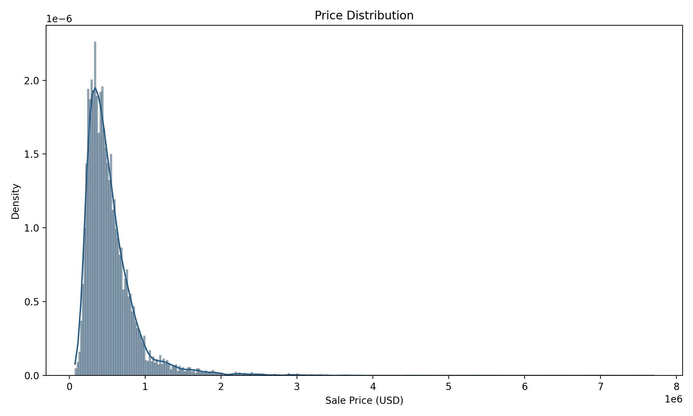
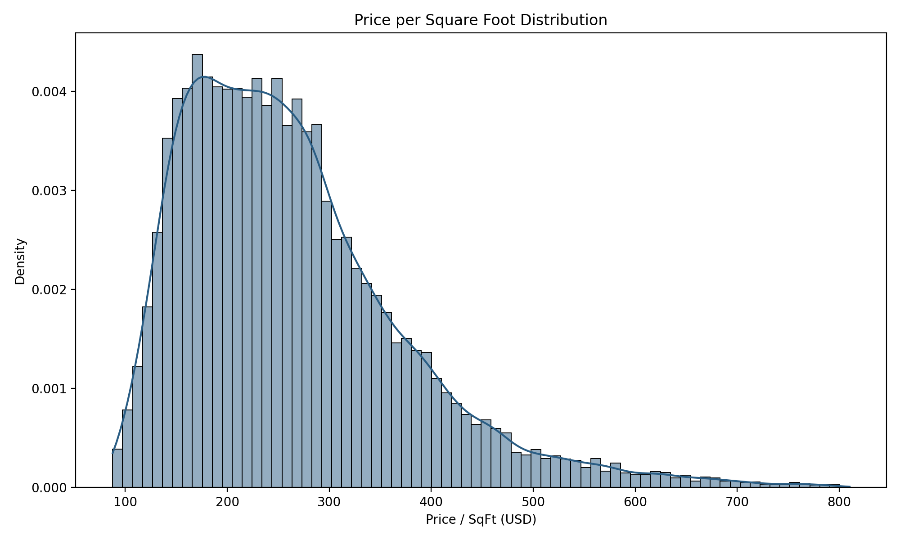
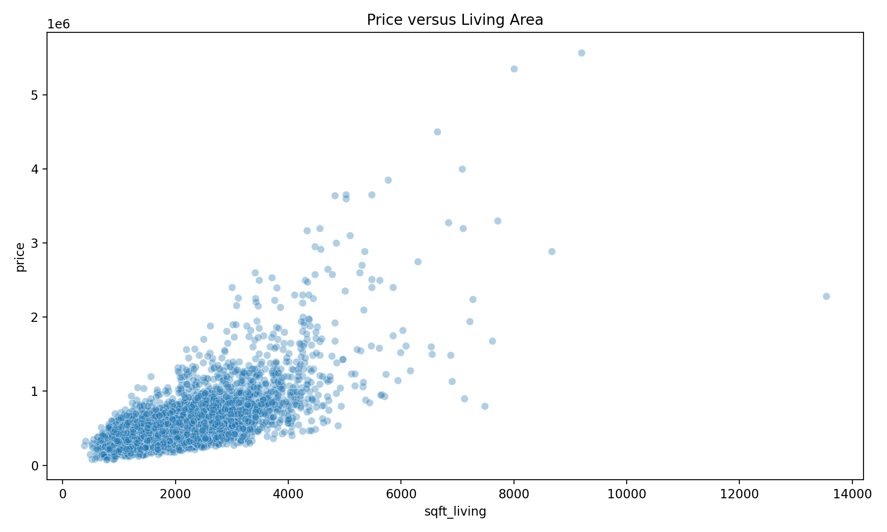
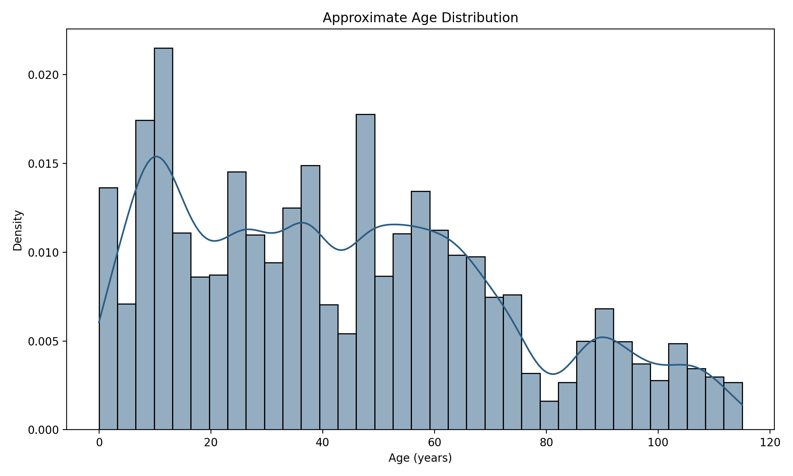
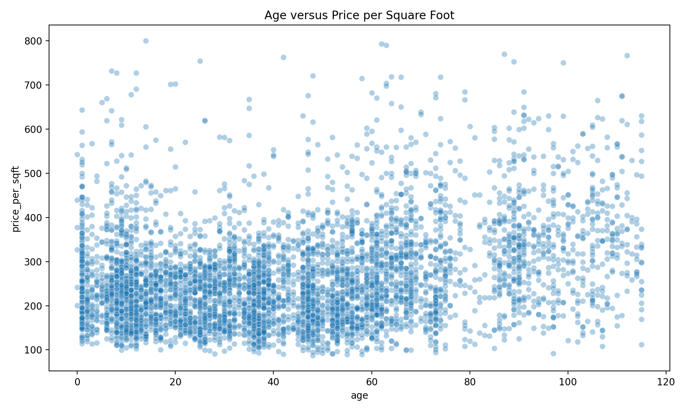
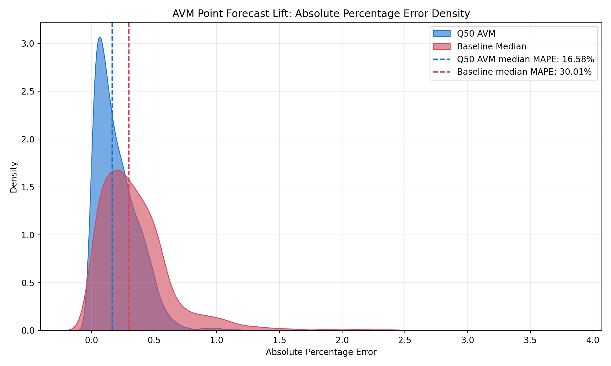

# Risk-Aware Real Estate Pricing Engine

A production-grade pricing system that predicts not just a single home value, but a value range and a confidence score for each property. This project combines a quantile forecast model with a secondary error model, then uses uncertainty to shape risk-aware offers.

## What this project does

- Predicts a conservative lower bound, a central expected value, and an optimistic upper bound for each home.
- Measures how reliable those predictions are by learning from the primary model's past errors.
- Calibrates the predicted range so it hits the target coverage rate.
- Converts uncertainty into a risk-adjusted buy offer.
- Applies market-level feedback using recent resale outcomes.

## Pipeline overview

This pipeline is built around six clear stages:

1. Data loading and clean filtering of bad transactions
2. Feature engineering for structure, seasonality, and geography
3. Primary quantile model producing low / median / high forecasts
4. Secondary meta-error model producing a confidence score (EES)
5. Calibration to make interval coverage reliable
6. Offer generation and optional market feedback adjustments

## Visual diagnostics

These charts are generated by the EDA pipeline and embedded directly from the project outputs.

### Price distribution



### Price per square foot distribution



### Price versus living area



### Property age distribution



### Age versus price per square foot



## Plain-language model logic

- The primary model produces three price estimates: a lower estimate, a middle estimate, and an upper estimate.
- The gap between the lower and upper estimate is treated as the property-level uncertainty range.
- The secondary model learns how far the primary forecast tends to miss and converts that into an Expected Error Score (EES) from 0 to 100.
- Calibration adjusts the range so the model is neither too confident nor too conservative.
- The offer engine starts from the middle estimate and increases the discount for higher-uncertainty properties.
- Market feedback is used to shift future forecasts based on recent realized sale ratios, without retraining the original model.

### Generated phase 1 outputs

- `outputs/1_eda/data_quality_report.md`
- `outputs/1_eda/price_distribution.png`
- `outputs/1_eda/price_per_sqft_distribution.png`
- `outputs/1_eda/price_vs_sqft.png`
- `outputs/1_eda/age_distribution.png`
- `outputs/2_point_avm_baseline/model_lift_comparison.png`
- `outputs/2_point_avm_baseline/baseline_lift_summary.md`

## Latest verified results

The latest verified full production pipeline run against `./kc_house_data.csv` completed successfully after removing `lat`, `long`, `sqft_living15`, and `sqft_lot15` from the feature input.

- Total properties priced: 2589
- Total portfolio value (median forecast): $1,041,125,294
- Total buy offer value: $870,947,423
- Average bid spread: 16.44%

### Baseline comparison results

The latest regenerated AVM Q50 forecast beat the rolling monthly median baseline on the held-out test set after the same feature removal:

- Median MAPE: 16.58% vs. 30.01% (13.43 percentage points better)
- RMSE: 147,663.36 vs. 203,934.95 (56,271.59 lower)



## Installation

```bash
pip install -r requirements.txt
```

## Run the full production pipeline

```bash
python main.py --base-spread 0.05 --target-coverage 0.80
```

## Run phase 1 diagnostics

```bash
python 1_king_county_eda.py --data-path ./kc_house_data.csv
python 2_point_avm_baseline.py --data-path ./kc_house_data.csv
```

## Python API example

```python
from main import RiskAwareREPricingPipeline

pipeline = RiskAwareREPricingPipeline(data_path="./kc_house_data.csv")
results = pipeline.run_full_pipeline()

offer_report = results["offer_report"]
print(offer_report.head(10)[["property_id", "median_forecast", "buy_offer_price", "ees_score"]])
```

## Core concepts without equations

- **Q10:** a conservative lower price estimate.
- **Q50:** the central expected price estimate.
- **Q90:** an optimistic upper price estimate.
- **Uncertainty:** the width of the Q10–Q90 range.
- **EES:** a 0-100 confidence score for how reliable the forecast is.
- **Calibration:** a step that makes interval coverage match the chosen confidence level.
- **Offer generation:** starts from Q50 and increases the discount for higher uncertainty.

## Why this matters

This system is designed for acquisition decisions, not just value estimation. It gives buyers a price range and a risk signal, so offer decisions can be made with richer, more disciplined information.

